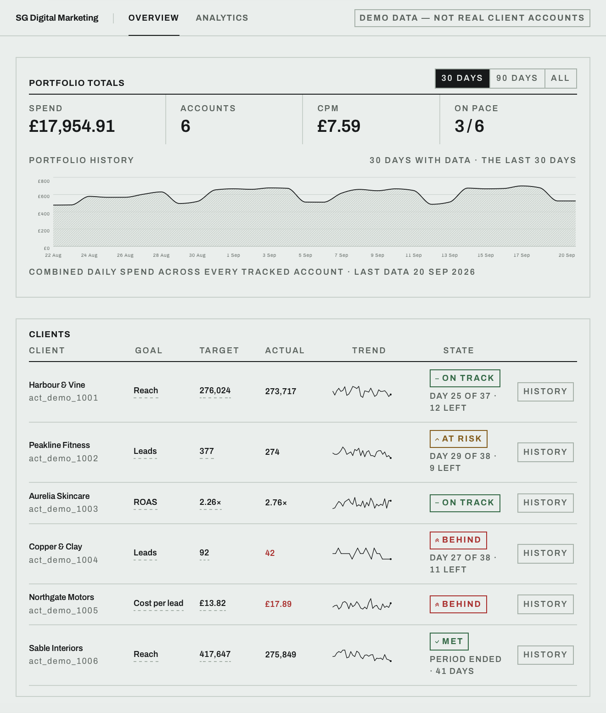

# Meta Agency Dashboard

Every client's Meta ad account in one normalised view, each measured against its own goal.



Meta Ads Manager displays only one ad account at a time, which makes managing multiple clients slow and fragmented. Built for freelance Meta ads work, this dashboard consolidates all client accounts into a single view, with portfolio-wide totals and trend charts that surface underperformance early and support faster, better-informed campaign adjustments.

The deployed instance runs a seeded six-client portfolio with mixed objectives.

## What it does

- **Overview** shows the portfolio: total spend, number of accounts, CPM, and how many clients are on pace. Underneath, a daily spend chart on a real time axis, and one row per client with its goal, target, actual and pace state.
- **Analytics** takes one client at a time, read-only: period-over-period comparison, CPA or cost per 1,000 reached (whichever the objective makes meaningful), CTR and frequency trends, and a campaign / ad set breakdown.

## Architecture

A nightly GitHub Actions job pulls each account's insights into PostgreSQL. The dashboard reads only from that store and never queries Meta live, which keeps it off the Marketing API's rate limits and makes page loads fast regardless of how many accounts are connected.

## Tech stack

- Python + FastAPI — API, goal-metric registry, pace evaluation
- PostgreSQL (Supabase) — insights store, SQLite fallback for local runs
- React + Vite + Recharts — front end
- GitHub Actions — nightly ingest
- Meta Marketing API — campaign, account and ad set insights

## Running it

```bash
# 1. API (reads DATABASE_URL, falls back to local SQLite)
python -m uvicorn app.main:app --reload

# 2. Dashboard
npm --prefix frontend install
npm --prefix frontend run dev

# 3. Ingest — yesterday by default
python -m ingest.run

#    or a backfill over a date range
python -m ingest.run --since 2026-07-01 --until 2026-07-31
```

## Demo mode

```bash
DEMO_MODE=true python -m uvicorn app.main:app
```

## Repository layout

| Path | Purpose |
| --- | --- |
| `ingest/` | Meta pull: campaigns, account and ad set insights |
| `app/` | FastAPI, goal-metric registry, pace evaluation |
| `app/demo.py` | Seeded six-client portfolio for demo mode |
| `frontend/` | React + Vite + Recharts dashboard |
